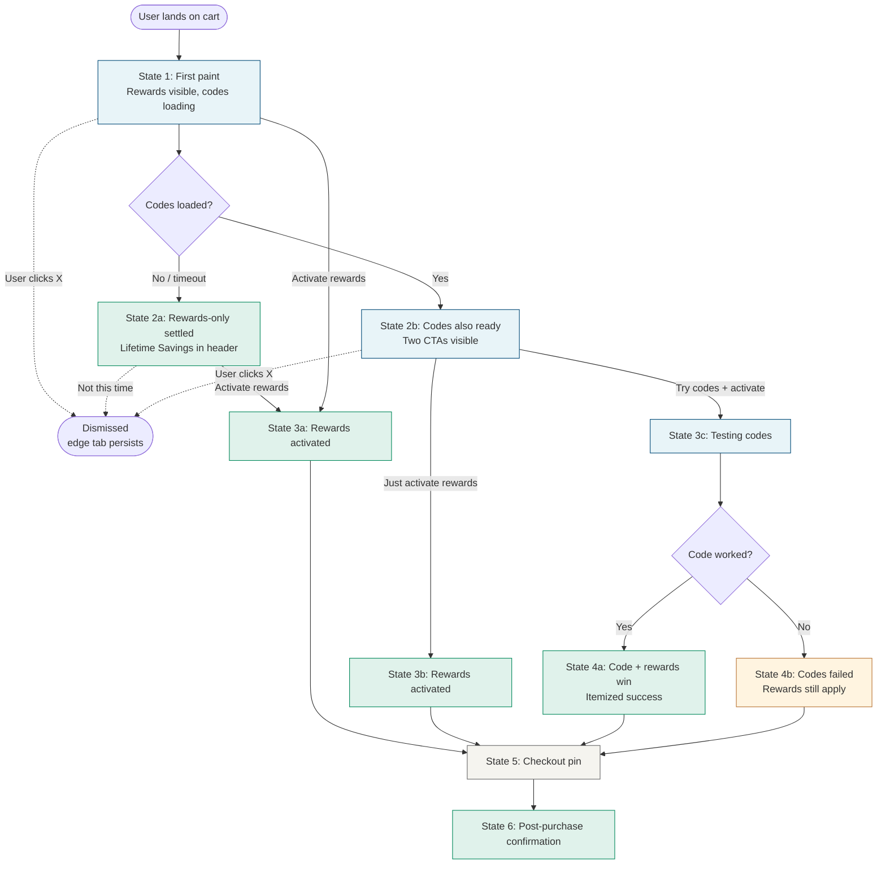

# Shopping Extension Notification Redesign

A unified notification flow for cart/checkout pages that handles four real-world scenarios with a single design system:

1. Coupons available and likely to work
2. Coupons available but uncertain
3. No coupons, rewards available
4. Coupons tried, none worked

The design treats **rewards as the deterministic floor** and **coupons as the upside**. Every path through the flow ends with the user activating rewards, regardless of whether coupons existed or succeeded.

---

## Table of contents

- [Design principles](#design-principles)
- [Full journey map](#full-journey-map)
- [State 1 — First paint](#state-1--first-paint)
- [State 2a — Rewards-only settled](#state-2a--rewards-only-settled)
- [State 2b — Codes also ready](#state-2b--codes-also-ready)
- [State 3a / 3b — Rewards activated (no codes path)](#state-3a--3b--rewards-activated-no-codes-path)
- [State 3c — Testing codes](#state-3c--testing-codes)
- [State 4a — Code + rewards win](#state-4a--code--rewards-win)
- [State 4b — Codes failed, rewards still apply](#state-4b--codes-failed-rewards-still-apply)
- [State 5 — Checkout pin](#state-5--checkout-pin)
- [State 6 — Post-purchase confirmation](#state-6--post-purchase-confirmation)
- [Implementation notes](#implementation-notes)
- [Open questions](#open-questions)

---

## Design principles

**Rewards is the deterministic floor; codes are the upside.** Every state — whether codes succeed, fail, or don't exist — ends with the user activating rewards. This maximizes per-session activation by making rewards the *minimum guaranteed value* of every interaction, not a competing alternative to codes.

**Progressive loading matches the technical reality.** Rewards loads fast (URL match, ~100ms); codes need full DOM (~1-3s). Rather than waiting for both, the notification paints with rewards as the hero and *enhances* with codes when they become available. If codes never arrive, the experience gracefully settles into rewards-only.

**Copy gradient matches certainty.** Codes get hedged language ("ready to try", "3,427 saved today"). Rewards gets specific dollar language ("$3.64 back", "rewards activated"). The honesty calibrates user trust correctly.

**Visual weight is inversely proportional to user uncertainty.** Loud on first paint when the user doesn't know the offer. Loudest at the success moment when the win needs celebrating. Smallest at checkout when the user needs to focus on payment. Re-expanded post-purchase to close the loop.

**Lifetime Savings is the persistent identity element.** It appears in the header from State 2a onward, ticking visibly at every value-delivering moment. This is the brand's strongest narrative device — the user accumulating value over time, made visible.

**The X means "I don't want to engage at all."** It's only visible in States 1 and 2b, before the user has committed to anything. Once a decision is made, X disappears and Lifetime Savings takes its place. There's never a moment with two dismiss paths.

---

## Full journey map



---

## State 1 — First paint

**When:** ~100ms after URL match on cart/checkout page.
**Goal:** Show the rewards offer immediately; hint that codes may be coming.

The notification appears with rewards as the hero. The footer hedges with "Checking for codes…" — language designed not to promise anything that might not arrive.

The "Exclusions apply" tooltip link sits beside the cart amount. Hovering (desktop) or tapping (mobile) reveals the full exclusion text in a dark tooltip.

```svg
<svg width="360" height="380" viewBox="0 0 360 380" xmlns="http://www.w3.org/2000/svg">
  <rect x="20" y="20" width="320" height="340" rx="12" fill="white" stroke="#E5E4DF" stroke-width="0.5"/>
  <rect x="20" y="20" width="320" height="340" rx="12" fill="none" stroke="black" stroke-opacity="0.06" stroke-width="0.5"/>

  <rect x="40" y="40" width="32" height="16" rx="2" fill="#E5E4DF"/>
  <text x="56" y="51" text-anchor="middle" font-family="system-ui, sans-serif" font-size="8" fill="#999">LOGO</text>

  <text x="320" y="52" text-anchor="end" font-family="system-ui, sans-serif" font-size="14" fill="#666">×</text>

  <text x="40" y="86" font-family="system-ui, sans-serif" font-size="12" fill="#666">Earn rewards on this order</text>
  <text x="40" y="118" font-family="system-ui, sans-serif" font-size="26" font-weight="500" fill="#004977">$3.64 back</text>
  <text x="40" y="142" font-family="system-ui, sans-serif" font-size="12" fill="#666">2% on your $182 Sephora cart</text>
  <text x="218" y="142" font-family="system-ui, sans-serif" font-size="11" fill="#666" text-decoration="underline">Exclusions apply ⓘ</text>

  <rect x="40" y="166" width="280" height="40" rx="20" fill="#004977"/>
  <text x="180" y="190" text-anchor="middle" font-family="system-ui, sans-serif" font-size="13" font-weight="500" fill="white">Activate rewards</text>

  <line x1="40" y1="226" x2="320" y2="226" stroke="#E5E4DF" stroke-width="0.5"/>

  <circle cx="56" cy="248" r="8" fill="none" stroke="#E5E4DF" stroke-width="2"/>
  <path d="M 56 240 A 8 8 0 0 1 64 248" fill="none" stroke="#666" stroke-width="2" stroke-linecap="round"/>
  <text x="76" y="252" font-family="system-ui, sans-serif" font-size="12" fill="#666">Checking for codes…</text>
</svg>
```

**Available actions:**

- `Activate rewards` → State 3a
- `×` (dismiss) → edge tab persists for the session
- Wait passively → State 2a (codes timed out) or State 2b (codes loaded)

**Tooltip content** (on hover/tap of "Exclusions apply"):

> **Exclusions apply**
> Not eligible for purchases of gift cards, or on orders deemed by Sephora to be for reseller activity.

---

## State 2a — Rewards-only settled

**When:** Codes search ended without results, or timed out at 5 seconds.
**Goal:** Settle into a clean rewards-only pitch backed by social proof.

The "Checking for codes…" footer fades out (~300ms). The social proof card slides up to take its place. The header X is replaced with Lifetime Savings via a 200ms crossfade.

```svg
<svg width="360" height="380" viewBox="0 0 360 380" xmlns="http://www.w3.org/2000/svg">
  <rect x="20" y="20" width="320" height="340" rx="12" fill="white" stroke="#E5E4DF" stroke-width="0.5"/>
  <rect x="20" y="20" width="320" height="340" rx="12" fill="none" stroke="black" stroke-opacity="0.06" stroke-width="0.5"/>

  <rect x="40" y="40" width="32" height="16" rx="2" fill="#E5E4DF"/>
  <text x="56" y="51" text-anchor="middle" font-family="system-ui, sans-serif" font-size="8" fill="#999">LOGO</text>

  <text x="320" y="52" text-anchor="end" font-family="system-ui, sans-serif" font-size="13" font-weight="500" fill="#0066CC">$792</text>
  <text x="320" y="64" text-anchor="end" font-family="system-ui, sans-serif" font-size="10" fill="#666">Lifetime Savings</text>

  <text x="40" y="92" font-family="system-ui, sans-serif" font-size="12" fill="#666">Earn rewards on this order</text>
  <text x="40" y="124" font-family="system-ui, sans-serif" font-size="26" font-weight="500" fill="#004977">$3.64 back</text>
  <text x="40" y="148" font-family="system-ui, sans-serif" font-size="12" fill="#666">2% on your $182 Sephora cart</text>
  <text x="218" y="148" font-family="system-ui, sans-serif" font-size="11" fill="#666" text-decoration="underline">Exclusions apply ⓘ</text>

  <rect x="40" y="168" width="280" height="40" rx="8" fill="#F5F4EF"/>
  <circle cx="58" cy="188" r="4" fill="#00875A"/>
  <circle cx="58" cy="188" r="7" fill="#00875A" fill-opacity="0.25"/>
  <text x="76" y="184" font-family="system-ui, sans-serif" font-size="11" fill="#1A1A1A"><tspan font-weight="500">1,842 shoppers</tspan> activated</text>
  <text x="76" y="198" font-family="system-ui, sans-serif" font-size="11" fill="#1A1A1A">at Sephora today</text>

  <rect x="40" y="226" width="280" height="40" rx="20" fill="#004977"/>
  <text x="180" y="250" text-anchor="middle" font-family="system-ui, sans-serif" font-size="13" font-weight="500" fill="white">Activate rewards</text>

  <text x="180" y="290" text-anchor="middle" font-family="system-ui, sans-serif" font-size="12" fill="#666">Not this time</text>
</svg>
```

**Available actions:**

- `Activate rewards` → State 3a
- `Not this time` → dismissed (edge tab persists)

---

## State 2b — Codes also ready

**When:** Codes resolved with results before the timeout.
**Goal:** Present codes as additive to rewards, with clear primary and secondary paths.

The codes card slides in below rewards with a 200ms drop animation. A green left-border accent fades in for ~2 seconds to draw the eye to the new content. The primary CTA upgrades to "Try codes + activate rewards" — the combined action. The secondary CTA — "Just activate rewards" — exists for users who don't want to wait through code testing.

```svg
<svg width="360" height="440" viewBox="0 0 360 440" xmlns="http://www.w3.org/2000/svg">
  <rect x="20" y="20" width="320" height="400" rx="12" fill="white" stroke="#E5E4DF" stroke-width="0.5"/>
  <rect x="20" y="20" width="320" height="400" rx="12" fill="none" stroke="black" stroke-opacity="0.06" stroke-width="0.5"/>

  <rect x="40" y="40" width="32" height="16" rx="2" fill="#E5E4DF"/>
  <text x="56" y="51" text-anchor="middle" font-family="system-ui, sans-serif" font-size="8" fill="#999">LOGO</text>

  <text x="320" y="52" text-anchor="end" font-family="system-ui, sans-serif" font-size="14" fill="#666">×</text>

  <text x="40" y="86" font-family="system-ui, sans-serif" font-size="12" fill="#666">Earn rewards on this order</text>
  <text x="40" y="118" font-family="system-ui, sans-serif" font-size="26" font-weight="500" fill="#004977">$3.64 back</text>
  <text x="40" y="142" font-family="system-ui, sans-serif" font-size="12" fill="#666">2% on your $182 Sephora cart</text>
  <text x="218" y="142" font-family="system-ui, sans-serif" font-size="11" fill="#666" text-decoration="underline">Exclusions apply ⓘ</text>

  <rect x="40" y="162" width="280" height="56" rx="8" fill="#F5F4EF"/>
  <rect x="40" y="162" width="2" height="56" fill="#00875A"/>
  <circle cx="64" cy="190" r="14" fill="white"/>
  <text x="64" y="195" text-anchor="middle" font-family="system-ui, sans-serif" font-size="14" fill="#004977">🏷</text>
  <text x="88" y="186" font-family="system-ui, sans-serif" font-size="12" font-weight="500" fill="#1A1A1A">5 codes also ready</text>
  <text x="88" y="202" font-family="system-ui, sans-serif" font-size="11" fill="#666">3,427 saved here today</text>

  <rect x="40" y="234" width="280" height="40" rx="20" fill="#004977"/>
  <text x="180" y="258" text-anchor="middle" font-family="system-ui, sans-serif" font-size="13" font-weight="500" fill="white">Try codes + activate rewards</text>

  <rect x="40" y="282" width="280" height="40" rx="20" fill="white" stroke="#E5E4DF" stroke-width="0.5"/>
  <text x="180" y="306" text-anchor="middle" font-family="system-ui, sans-serif" font-size="12" font-weight="500" fill="#004977">Just activate rewards</text>
</svg>
```

**Available actions:**

- `Try codes + activate rewards` → State 3c (testing) → State 4a or 4b
- `Just activate rewards` → State 3b
- `×` (dismiss) → edge tab persists

---

## State 3a / 3b — Rewards activated (no codes path)

**When:** User clicked `Activate rewards` (3a) or `Just activate rewards` (3b). Same end state.
**Goal:** Confirm activation, deliver the dopamine hit of the Lifetime Savings tick-up.

The Lifetime Savings number animates from $792 → $795.64 over ~1.2 seconds. The old value briefly stays crossed out to emphasize the jump. Header treatment is permanent — there's no X because the action is complete.

```svg
<svg width="360" height="380" viewBox="0 0 360 380" xmlns="http://www.w3.org/2000/svg">
  <rect x="20" y="20" width="320" height="340" rx="12" fill="white" stroke="#E5E4DF" stroke-width="0.5"/>
  <rect x="20" y="20" width="320" height="340" rx="12" fill="none" stroke="black" stroke-opacity="0.06" stroke-width="0.5"/>

  <rect x="40" y="40" width="32" height="16" rx="2" fill="#E5E4DF"/>
  <text x="56" y="51" text-anchor="middle" font-family="system-ui, sans-serif" font-size="8" fill="#999">LOGO</text>

  <text x="244" y="52" text-anchor="end" font-family="system-ui, sans-serif" font-size="11" fill="#999" text-decoration="line-through">$792</text>
  <text x="296" y="52" text-anchor="end" font-family="system-ui, sans-serif" font-size="13" font-weight="500" fill="#0066CC">$795.64</text>
  <text x="320" y="52" text-anchor="end" font-family="system-ui, sans-serif" font-size="10" fill="#666">Lifetime</text>

  <circle cx="60" cy="100" r="20" fill="#E0F2EB"/>
  <text x="60" y="107" text-anchor="middle" font-family="system-ui, sans-serif" font-size="20" fill="#00875A">✓</text>

  <text x="92" y="98" font-family="system-ui, sans-serif" font-size="14" font-weight="500" fill="#1A1A1A">Rewards activated</text>
  <text x="92" y="116" font-family="system-ui, sans-serif" font-size="11" fill="#666">$3.64 will be credited after checkout</text>

  <rect x="40" y="146" width="280" height="50" rx="8" fill="#F5F4EF"/>
  <text x="56" y="170" font-family="system-ui, sans-serif" font-size="11" fill="#666">We'll apply your 2% back automatically —</text>
  <text x="56" y="186" font-family="system-ui, sans-serif" font-size="11" fill="#666">nothing extra to do at checkout.</text>

  <text x="46" y="218" font-family="system-ui, sans-serif" font-size="10" fill="#999"><tspan font-weight="500">Exclusions apply:</tspan> Not eligible for purchases</text>
  <text x="46" y="232" font-family="system-ui, sans-serif" font-size="10" fill="#999">of gift cards, or on orders deemed by Sephora</text>
  <text x="46" y="246" font-family="system-ui, sans-serif" font-size="10" fill="#999">to be for reseller activity.</text>

  <rect x="40" y="262" width="280" height="36" rx="18" fill="white" stroke="#004977" stroke-width="0.5"/>
  <text x="180" y="284" text-anchor="middle" font-family="system-ui, sans-serif" font-size="12" font-weight="500" fill="#004977">Continue to checkout</text>
</svg>
```

**Transition behavior:**

- Lifetime Savings ticks $792 → $795.64 over ~1.2s
- Panel auto-collapses to `+$3.64 ready` pin after 4 seconds
- User can keep shopping; pin stays in corner until checkout

---

## State 3c — Testing codes

**When:** User clicked `Try codes + activate rewards`. Rewards activation happens silently in the background.
**Goal:** Show live progress as codes are tested. Reassure that rewards are already locked in.

The header shifts to Lifetime Savings (the X is gone because the activate decision was already made). The code list ticks green one-by-one as each is tested. The footer is the safety net: "$3.64 rewards already locked in" tells the user they've already won.

```svg
<svg width="360" height="460" viewBox="0 0 360 460" xmlns="http://www.w3.org/2000/svg">
  <rect x="20" y="20" width="320" height="420" rx="12" fill="white" stroke="#E5E4DF" stroke-width="0.5"/>
  <rect x="20" y="20" width="320" height="420" rx="12" fill="none" stroke="black" stroke-opacity="0.06" stroke-width="0.5"/>

  <rect x="40" y="40" width="32" height="16" rx="2" fill="#E5E4DF"/>
  <text x="56" y="51" text-anchor="middle" font-family="system-ui, sans-serif" font-size="8" fill="#999">LOGO</text>

  <text x="320" y="52" text-anchor="end" font-family="system-ui, sans-serif" font-size="13" font-weight="500" fill="#0066CC">$792</text>
  <text x="320" y="64" text-anchor="end" font-family="system-ui, sans-serif" font-size="10" fill="#666">Lifetime Savings</text>

  <rect x="40" y="86" width="280" height="48" rx="8" fill="#F5F4EF"/>
  <circle cx="64" cy="110" r="10" fill="none" stroke="#E5E4DF" stroke-width="2"/>
  <path d="M 64 100 A 10 10 0 0 1 74 110" fill="none" stroke="#004977" stroke-width="2" stroke-linecap="round"/>
  <text x="84" y="106" font-family="system-ui, sans-serif" font-size="12" font-weight="500" fill="#1A1A1A">Testing code 2 of 5…</text>
  <text x="84" y="122" font-family="system-ui, sans-serif" font-size="11" fill="#666">Usually ~2 seconds</text>

  <text x="46" y="158" font-family="system-ui, sans-serif" font-size="14" fill="#00875A">✓</text>
  <text x="66" y="158" font-family="monospace, sans-serif" font-size="11" fill="#1A1A1A">BROWSHADE</text>
  <text x="312" y="158" text-anchor="end" font-family="system-ui, sans-serif" font-size="10" fill="#666">tested</text>

  <rect x="40" y="170" width="280" height="22" rx="4" fill="#F5F4EF"/>
  <circle cx="56" cy="181" r="5" fill="none" stroke="#004977" stroke-width="2"/>
  <path d="M 56 176 A 5 5 0 0 1 61 181" fill="none" stroke="#004977" stroke-width="2"/>
  <text x="66" y="186" font-family="monospace, sans-serif" font-size="11" font-weight="500" fill="#004977">HAIRYOUTH</text>

  <text x="46" y="212" font-family="system-ui, sans-serif" font-size="14" fill="#CCC">○</text>
  <text x="66" y="212" font-family="monospace, sans-serif" font-size="11" fill="#999">FRESHLOOK</text>

  <text x="46" y="234" font-family="system-ui, sans-serif" font-size="14" fill="#CCC">○</text>
  <text x="66" y="234" font-family="monospace, sans-serif" font-size="11" fill="#999">BEAUTY10</text>

  <text x="46" y="256" font-family="system-ui, sans-serif" font-size="14" fill="#CCC">○</text>
  <text x="66" y="256" font-family="monospace, sans-serif" font-size="11" fill="#999">SPRING25</text>

  <line x1="40" y1="278" x2="320" y2="278" stroke="#E5E4DF" stroke-width="0.5"/>

  <text x="46" y="304" font-family="system-ui, sans-serif" font-size="14" fill="#00875A">✓</text>
  <text x="66" y="304" font-family="system-ui, sans-serif" font-size="11" fill="#666"><tspan fill="#1A1A1A" font-weight="500">$3.64 rewards</tspan> already locked in</text>
</svg>
```

**Transition triggers:**

- Any code works → State 4a
- All codes fail → State 4b
- Each code resolves in sequence with an ~80ms scale + green-wash animation

---

## State 4a — Code + rewards win

**When:** A code worked AND rewards were activated.
**Goal:** Celebrate the double win with an itemized receipt format.

Lifetime Savings ticks dramatically: $792 → $813.48 (combined code + rewards). The receipt format shows both wins as separate line items so the user understands exactly what they got from each path.

```svg
<svg width="360" height="440" viewBox="0 0 360 440" xmlns="http://www.w3.org/2000/svg">
  <rect x="20" y="20" width="320" height="400" rx="12" fill="white" stroke="#E5E4DF" stroke-width="0.5"/>
  <rect x="20" y="20" width="320" height="400" rx="12" fill="none" stroke="black" stroke-opacity="0.06" stroke-width="0.5"/>

  <rect x="40" y="40" width="32" height="16" rx="2" fill="#E5E4DF"/>
  <text x="56" y="51" text-anchor="middle" font-family="system-ui, sans-serif" font-size="8" fill="#999">LOGO</text>

  <text x="240" y="52" text-anchor="end" font-family="system-ui, sans-serif" font-size="11" fill="#999" text-decoration="line-through">$792</text>
  <text x="296" y="52" text-anchor="end" font-family="system-ui, sans-serif" font-size="13" font-weight="500" fill="#0066CC">$813.48</text>
  <text x="320" y="52" text-anchor="end" font-family="system-ui, sans-serif" font-size="10" fill="#666">Lifetime</text>

  <circle cx="60" cy="100" r="20" fill="#E0F2EB"/>
  <text x="60" y="107" text-anchor="middle" font-family="system-ui, sans-serif" font-size="20" fill="#00875A">✓</text>

  <text x="92" y="98" font-family="system-ui, sans-serif" font-size="14" font-weight="500" fill="#1A1A1A">You're all set</text>
  <text x="92" y="116" font-family="system-ui, sans-serif" font-size="11" fill="#666">Two ways saved at Sephora</text>

  <rect x="40" y="146" width="280" height="90" rx="8" fill="#F5F4EF"/>
  <text x="56" y="172" font-family="system-ui, sans-serif" font-size="12" fill="#1A1A1A">Code applied</text>
  <text x="56" y="186" font-family="monospace, sans-serif" font-size="10" fill="#666">BROWSHADE</text>
  <text x="304" y="178" text-anchor="end" font-family="system-ui, sans-serif" font-size="14" font-weight="500" fill="#004977">−$18.20</text>
  <line x1="56" y1="200" x2="304" y2="200" stroke="#E5E4DF" stroke-width="0.5"/>
  <text x="56" y="220" font-family="system-ui, sans-serif" font-size="12" fill="#1A1A1A">Rewards activated</text>
  <text x="304" y="220" text-anchor="end" font-family="system-ui, sans-serif" font-size="14" font-weight="500" fill="#00875A">+$3.28</text>

  <text x="46" y="262" font-family="system-ui, sans-serif" font-size="10" fill="#999"><tspan font-weight="500">Exclusions apply:</tspan> Not eligible for purchases of</text>
  <text x="46" y="276" font-family="system-ui, sans-serif" font-size="10" fill="#999">gift cards, or on orders deemed by Sephora to be</text>
  <text x="46" y="290" font-family="system-ui, sans-serif" font-size="10" fill="#999">for reseller activity.</text>

  <rect x="40" y="306" width="280" height="36" rx="18" fill="white" stroke="#004977" stroke-width="0.5"/>
  <text x="180" y="328" text-anchor="middle" font-family="system-ui, sans-serif" font-size="12" font-weight="500" fill="#004977">Continue to checkout</text>
</svg>
```

**Transition behavior:**

- Lifetime Savings ticks $792 → $813.48
- Panel auto-collapses to `+$21.48 ready` pin after 4 seconds

---

## State 4b — Codes failed, rewards still apply

**When:** All codes tested, none applied to the cart.
**Goal:** Reframe the codes miss as a rewards win. Honesty without apology.

"No codes worked this time, but $3.64 is yours" — acknowledge the miss, immediately reframe to the win. Lifetime Savings still ticks ($792 → $795.64) because even the failure path delivers value. The "this time" phrasing leaves room for future success without promising anything.

```svg
<svg width="360" height="440" viewBox="0 0 360 440" xmlns="http://www.w3.org/2000/svg">
  <rect x="20" y="20" width="320" height="400" rx="12" fill="white" stroke="#E5E4DF" stroke-width="0.5"/>
  <rect x="20" y="20" width="320" height="400" rx="12" fill="none" stroke="black" stroke-opacity="0.06" stroke-width="0.5"/>

  <rect x="40" y="40" width="32" height="16" rx="2" fill="#E5E4DF"/>
  <text x="56" y="51" text-anchor="middle" font-family="system-ui, sans-serif" font-size="8" fill="#999">LOGO</text>

  <text x="244" y="52" text-anchor="end" font-family="system-ui, sans-serif" font-size="11" fill="#999" text-decoration="line-through">$792</text>
  <text x="296" y="52" text-anchor="end" font-family="system-ui, sans-serif" font-size="13" font-weight="500" fill="#0066CC">$795.64</text>
  <text x="320" y="52" text-anchor="end" font-family="system-ui, sans-serif" font-size="10" fill="#666">Lifetime</text>

  <circle cx="60" cy="100" r="20" fill="#E0F2EB"/>
  <text x="60" y="107" text-anchor="middle" font-family="system-ui, sans-serif" font-size="20" fill="#00875A">✓</text>

  <text x="92" y="98" font-family="system-ui, sans-serif" font-size="14" font-weight="500" fill="#1A1A1A">Rewards activated</text>
  <text x="92" y="116" font-family="system-ui, sans-serif" font-size="11" fill="#666">No codes worked this time, but $3.64 is yours</text>

  <rect x="40" y="146" width="280" height="50" rx="8" fill="#F5F4EF"/>
  <text x="56" y="172" font-family="system-ui, sans-serif" font-size="12" fill="#1A1A1A">Rewards on this order</text>
  <text x="56" y="186" font-family="system-ui, sans-serif" font-size="10" fill="#666">2% back, credited after checkout</text>
  <text x="304" y="178" text-anchor="end" font-family="system-ui, sans-serif" font-size="14" font-weight="500" fill="#00875A">+$3.64</text>

  <text x="46" y="222" font-family="system-ui, sans-serif" font-size="11" fill="#999">We tested all 5 codes — none applied to your cart this time.</text>

  <text x="46" y="252" font-family="system-ui, sans-serif" font-size="10" fill="#999"><tspan font-weight="500">Exclusions apply:</tspan> Not eligible for purchases of</text>
  <text x="46" y="266" font-family="system-ui, sans-serif" font-size="10" fill="#999">gift cards, or on orders deemed by Sephora to be</text>
  <text x="46" y="280" font-family="system-ui, sans-serif" font-size="10" fill="#999">for reseller activity.</text>

  <rect x="40" y="296" width="280" height="36" rx="18" fill="white" stroke="#004977" stroke-width="0.5"/>
  <text x="180" y="318" text-anchor="middle" font-family="system-ui, sans-serif" font-size="12" font-weight="500" fill="#004977">Continue to checkout</text>
</svg>
```

---

## State 5 — Checkout pin

**When:** User has moved into the checkout funnel (shipping, payment, review).
**Goal:** Stay visible as a reassurance signal without competing with the merchant's checkout UI.

The extension's footprint shrinks dramatically — from a ~320px panel to a ~32px tall pill. The content adapts to what the user got:

**After State 4a (code + rewards win):**

```svg
<svg width="280" height="60" viewBox="0 0 280 60" xmlns="http://www.w3.org/2000/svg">
  <rect x="10" y="14" width="240" height="32" rx="16" fill="white" stroke="#E5E4DF" stroke-width="0.5"/>
  <rect x="10" y="14" width="240" height="32" rx="16" fill="none" stroke="black" stroke-opacity="0.06" stroke-width="0.5"/>
  <text x="28" y="34" font-family="system-ui, sans-serif" font-size="13" fill="#00875A">✓</text>
  <text x="46" y="34" font-family="system-ui, sans-serif" font-size="11" font-weight="500" fill="#1A1A1A">$18.20 off applied</text>
  <text x="142" y="34" font-family="system-ui, sans-serif" font-size="10" fill="#666">+ $3.28 back</text>
</svg>
```

**After States 3a / 3b / 4b (rewards only):**

```svg
<svg width="240" height="60" viewBox="0 0 240 60" xmlns="http://www.w3.org/2000/svg">
  <rect x="10" y="14" width="200" height="32" rx="16" fill="white" stroke="#E5E4DF" stroke-width="0.5"/>
  <rect x="10" y="14" width="200" height="32" rx="16" fill="none" stroke="black" stroke-opacity="0.06" stroke-width="0.5"/>
  <text x="28" y="34" font-family="system-ui, sans-serif" font-size="13" fill="#00875A">✓</text>
  <text x="46" y="34" font-family="system-ui, sans-serif" font-size="11" font-weight="500" fill="#1A1A1A">$3.64 back ready</text>
</svg>
```

No CTA, no decision. The pin is pure reassurance — "your savings are in, you can focus on payment."

---

## State 6 — Post-purchase confirmation

**When:** User reaches the order confirmation page.
**Goal:** Close the loop by itemizing exactly what the user earned. Seed the next visit.

This is the most underused moment in most shopping extensions. Most go silent post-purchase, so users have no idea whether their rewards actually applied. We do the opposite — surface the win and pull users toward deeper engagement.

```svg
<svg width="360" height="420" viewBox="0 0 360 420" xmlns="http://www.w3.org/2000/svg">
  <rect x="20" y="20" width="320" height="380" rx="12" fill="white" stroke="#E5E4DF" stroke-width="0.5"/>
  <rect x="20" y="20" width="320" height="380" rx="12" fill="none" stroke="black" stroke-opacity="0.06" stroke-width="0.5"/>

  <rect x="40" y="40" width="32" height="16" rx="2" fill="#E5E4DF"/>
  <text x="56" y="51" text-anchor="middle" font-family="system-ui, sans-serif" font-size="8" fill="#999">LOGO</text>

  <text x="296" y="52" text-anchor="end" font-family="system-ui, sans-serif" font-size="13" font-weight="500" fill="#0066CC">$813.48</text>
  <text x="320" y="52" text-anchor="end" font-family="system-ui, sans-serif" font-size="10" fill="#666">Lifetime Savings</text>

  <text x="40" y="92" font-family="system-ui, sans-serif" font-size="14" font-weight="500" fill="#1A1A1A">Nice — here's what you got</text>

  <rect x="40" y="110" width="280" height="40" rx="6" fill="#F5F4EF"/>
  <text x="56" y="134" font-family="system-ui, sans-serif" font-size="12" fill="#1A1A1A">Code applied at checkout</text>
  <text x="304" y="134" text-anchor="end" font-family="system-ui, sans-serif" font-size="13" font-weight="500" fill="#004977">−$18.20</text>

  <rect x="40" y="158" width="280" height="48" rx="6" fill="#F5F4EF"/>
  <text x="56" y="178" font-family="system-ui, sans-serif" font-size="12" fill="#1A1A1A">2% rewards earned</text>
  <text x="56" y="192" font-family="system-ui, sans-serif" font-size="10" fill="#666">Available in ~30 days</text>
  <text x="304" y="186" text-anchor="end" font-family="system-ui, sans-serif" font-size="13" font-weight="500" fill="#00875A">+$3.28</text>

  <line x1="40" y1="226" x2="320" y2="226" stroke="#E5E4DF" stroke-width="0.5"/>

  <text x="40" y="254" font-family="system-ui, sans-serif" font-size="12" fill="#666">Saved on this order</text>
  <text x="320" y="254" text-anchor="end" font-family="system-ui, sans-serif" font-size="18" font-weight="500" fill="#004977">$21.48</text>

  <rect x="40" y="282" width="280" height="36" rx="18" fill="white" stroke="#004977" stroke-width="0.5"/>
  <text x="180" y="304" text-anchor="middle" font-family="system-ui, sans-serif" font-size="12" font-weight="500" fill="#004977">See all my savings</text>
</svg>
```

The "$21.48 saved on this order" footer is the brag-worthy stat. The "See all my savings" CTA pulls users into the broader Capital One Shopping platform — natural follow-up once they care about their lifetime savings.

---

## Implementation notes

### Design tokens

**Colors**

| Token | Hex | Use |
|---|---|---|
| Primary navy | `#004977` | Primary CTAs, hero numbers, brand accent |
| Brand red | `#D03027` | Logo only — not used as a button fill |
| Success green | `#00875A` | Success indicators, rewards amounts |
| Success bg | `#E0F2EB` | Success icon backgrounds |
| Lifetime blue | `#0066CC` | Lifetime Savings number |
| Surface | `#F5F4EF` | Inline content cards |
| Border | `#E5E4DF` | Card borders, dividers |
| Text primary | `#1A1A1A` | Headlines, primary copy |
| Text secondary | `#666666` | Supporting copy |
| Text tertiary | `#999999` | Disclosures, fine print |

**Typography**

| Size | Use |
|---|---|
| 22-26px / 500 | Hero numbers (savings amounts) |
| 14px / 500 | Headlines (state titles) |
| 13px / 500 | Primary CTA button text |
| 12-13px / 400 | Supporting copy |
| 11px / 400 | Trust signals, metadata |
| 10px / 400 | Disclosures, exclusions |

**Border radius**

- Container: 12px
- Inline cards: 8px
- Buttons: 999px (pill)
- Small chips: 6px

### Animation tokens

| Element | Duration | Easing |
|---|---|---|
| Lifetime Savings tick-up | 1.2s | ease-out |
| Codes card slide-down (State 2b) | 200ms | ease-out with slight overshoot |
| Header crossfade (X ↔ Lifetime) | 200ms | ease-in-out |
| Code list checkmark reveal | 80ms | scale + green wash |
| Panel auto-collapse to pin | 180ms | scale + fade |
| Toast slide-in | 240ms | ease-out from above |
| Tooltip reveal | 150ms delay then 120ms fade-in | ease-out |

### Timing rules

- **Codes search timeout:** 5 seconds. Beyond this, transition to State 2a even if codes might still resolve.
- **Success state auto-collapse:** 4 seconds. Pin remains visible for the session.
- **Toast auto-dismiss** (if used at first paint): 8 seconds untouched. Edge tab persists after.
- **Green accent line on State 2b codes card:** Fade out after 2-3 seconds.

### Edge tab behavior

If a user dismisses via X at any state, the experience collapses to a slim edge tab pinned to the right side of the viewport (~24px wide × 60px tall, with the logo). It stays there for the rest of the session — accessible if the user wants to re-engage, but never re-prompting. Resets on next visit.

### Low-volume merchant fallback

If the today-activation count in State 2a's social proof card is below 50 ("12 shoppers activated…" reads as embarrassing), swap to brand-level proof:

> 12M+ members earn rewards with Capital One Shopping

The flow stays identical; only the content card changes. Threshold and fallback content should be configurable per merchant tier.

### Exclusions disclosure rules

- **State 1 (pre-decision):** Inline tooltip link beside the cart-amount line. Dotted underline + info icon. Renders on hover (desktop) or tap (mobile).
- **Activated states (3a, 3b, 4a, 4b):** Inline disclosure text above the "Continue to checkout" CTA. Uses tertiary text color at 10-11px. "Exclusions apply:" prefix is bolded for scannability.
- **State 2a, 2b:** Same tooltip pattern as State 1 (user hasn't activated yet).
- **State 5 (checkout pin):** No disclosure needed — the activated states already showed it.
- **State 6 (post-purchase):** Pending legal review — see open questions.

Exclusion text is per-merchant. Default fallback: "Some product exclusions may apply."

### Telemetry priorities

Track state-to-state transitions, not just clicks. The interesting questions:

- What % of users who reach State 1 reach State 3 (any activation)?
- What % of users who reach State 2b try codes vs just activate rewards?
- What % of code-testing sessions reach State 4a vs 4b?
- What % of activations reach State 6 (closed loop)?

Each conversion rate tells you where the funnel breaks.

---

## Open questions

**Legal review needed:**

1. Does the State 1 tooltip-only disclosure satisfy regulatory requirements at the moment of value claim, or does the full exclusions text need to be visible inline?
2. Should the post-purchase confirmation state (State 6) also include the exclusions disclosure? The order is final at that point, which may change the disclosure standard.
3. For merchants with exclusions text longer than ~3 lines, do we need a "See full exclusions" overlay pattern? Inline display would dominate the panel.

**Data infrastructure:**

1. The State 2a social proof count needs a source of truth that updates at least once daily. Confirm the data team can produce this reliably per-merchant.
2. The low-volume fallback threshold (currently set at 50) should be validated against real data — what's the actual distribution of daily activations per merchant?

**Engineering scope:**

1. Edge tab implementation — is one-session persistence the right window, or should it expire faster / slower?
2. Do we have telemetry capable of tracking state-to-state transitions, not just clicks?
3. Pre-engagement scenario: user clicks "Activate rewards" in State 1 before codes finish loading. Does the system gracefully handle the in-flight codes search and discard the result?

**Design decisions for follow-up:**

1. Mobile-specific tooltip behavior — tap to toggle, but what's the dismissal pattern when the user is mid-tooltip?
2. Lifetime Savings header in State 2b (codes-also-ready) — should this swap from X to Lifetime Savings if the user has been viewing the notification for 10+ seconds, or stay consistent with State 1?
3. The "See all my savings" CTA in State 6 — what page does this open? Opportunity to design the bridge into broader platform engagement.

---

*Document version: v1. For questions or feedback, contact the design team.*
